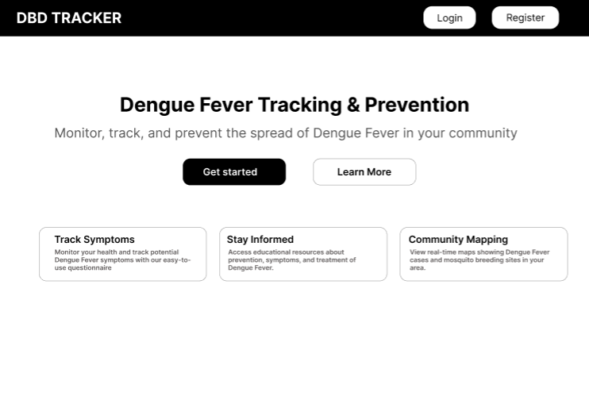
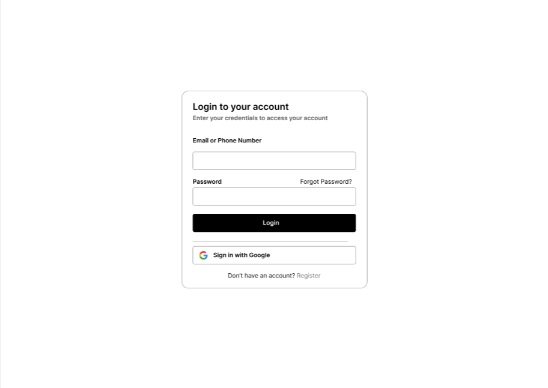
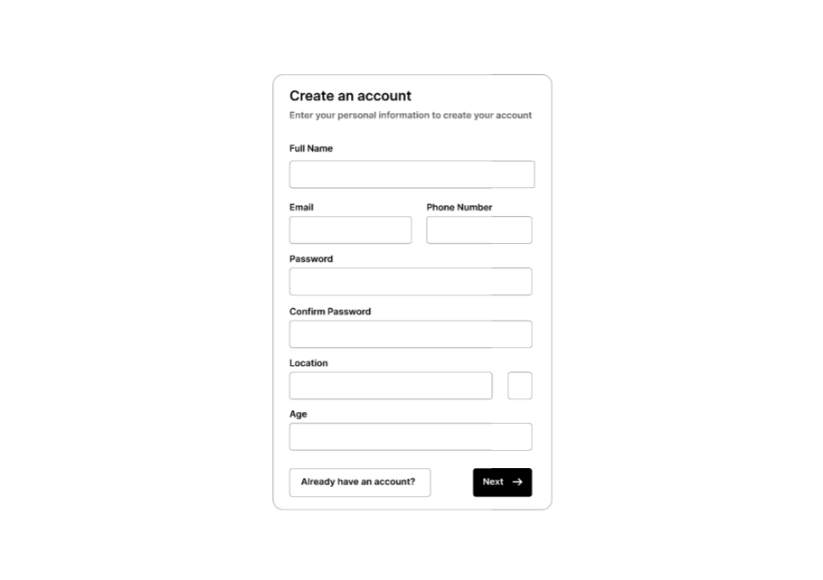
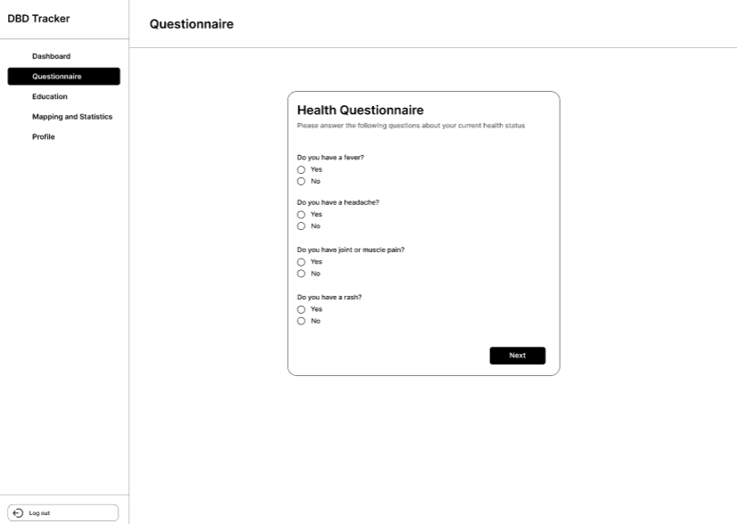
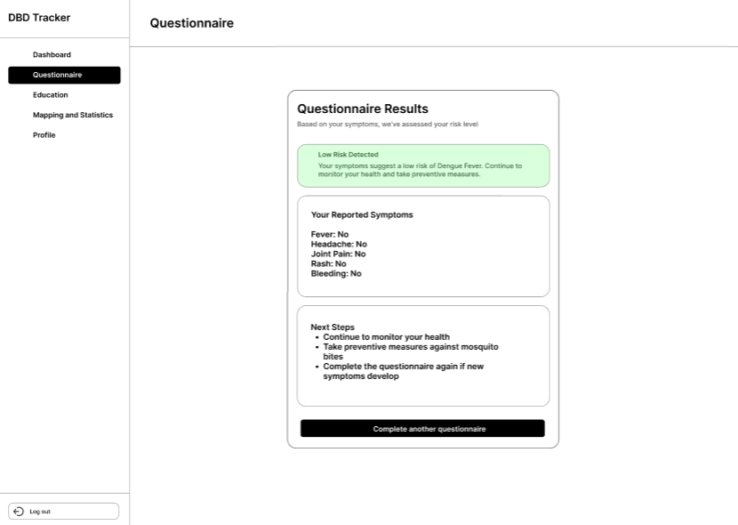
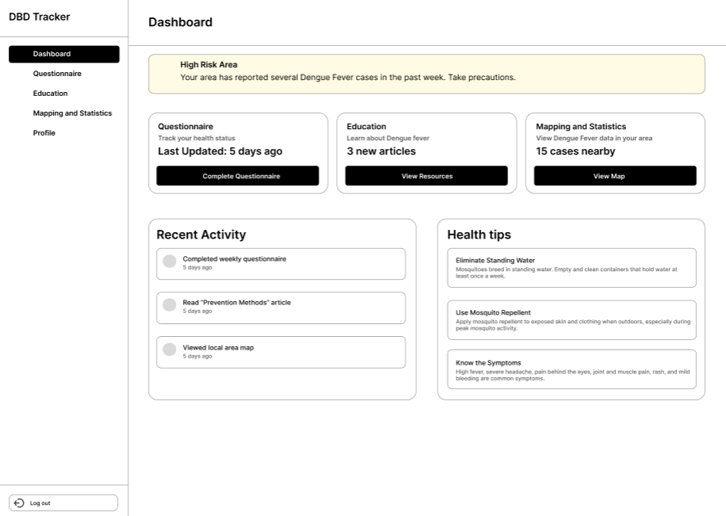
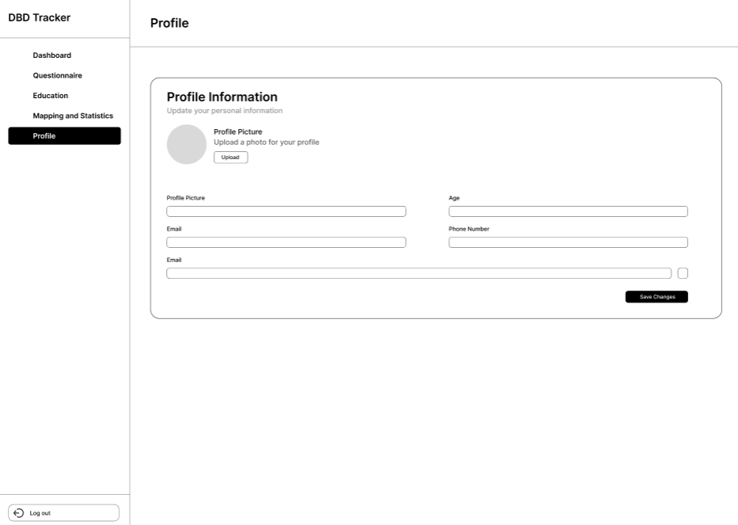

# 🌡️ FeverMap: Sistem Deteksi Potensi DBD Berbasis Data

**FeverMap** adalah proyek analitik data untuk mendeteksi potensi penyebaran **Demam Berdarah Dengue (DBD)** di wilayah Jakarta Selatan. Aplikasi ini mengintegrasikan berbagai sumber data seperti cuaca, kesehatan, sensor IoT, dan crowdsourced untuk menghasilkan deteksi dini risiko DBD.

## 📂 Struktur Proyek

```bash
Fever_Map/
├── Datasets/
│ ├── Data_Cuaca_Jakarta_Selatan.xlsx
│ ├── Data_Health_Jakarta_Selatan.xlsx
│ ├── Data_IoT_Sensor_DBD.xlsx
│ └── Data_Crowdsourced_DBD.csv
└── Script Python/
└── Script DBD App.py
```

## 🧠 Fitur Utama

- 🧪 **Penggabungan Data Multi-Sumber**: Data cuaca, data rumah sakit, data jentik dari sensor IoT, dan pelaporan warga.
- 📅 **Pengolahan Berdasarkan Tanggal**: Semua data diselaraskan berdasarkan waktu kejadian.
- 🤖 **Logika Deteksi Potensi DBD**: Menggunakan kombinasi kondisi suhu, kelembaban, laporan jentik, dan jumlah kasus.
- 📤 **Ekspor Otomatis ke Excel**: Hasil analisis disimpan dalam `Hasil_Deteksi_Potensi_DBD.xlsx`.

## ⚙️ Cara Menjalankan

### 1. **Persiapkan Environment**
Pastikan Anda memiliki `Python 3.x` serta pustaka berikut:

```bash
pip install pandas openpyxl
```

### 2. Jalankan Script
Masuk ke folder Script Python lalu jalankan:

```bash
python "Script DBD App.py"
```

### 3. Output
File Hasil_Deteksi_Potensi_DBD.xlsx akan muncul di folder yang sama setelah proses selesai.

| Dataset | Deskripsi |
|---------------|-------|
| Data_Cuaca_Jakarta_Selatan | Informasi suhu dan kelembaban harian |
| Data_Health_Jakarta_Selatan | Jumlah kasus DBD yang tercatat di fasilitas medis |
| Data_IoT_Sensor_DBD | Sensor jentik nyamuk di lingkungan warga |
| Data_Crowdsourced_DBD	| Laporan gejala demam dan jentik dari masyarakat |

## 📊 Data yang Digunakan

### Design UI/UX:
Link Figma : https://www.figma.com/design/rKDVImv7z4E4ch8tAHeqqz/Untitled?node-id=0-1&t=lVTlF9tZXdhqyOqQ-1

## 📸 Tampilan Antarmuka Aplikasi

### 🏠 Halaman Utama & Autentikasi

| Halaman Depan | Login | Register |
|---------------|-------|----------|
|  |  |  |

### 📝 Kuisioner & Hasil

| Kuisioner | Hasil Kuisioner |
|-----------|-----------------|
|  |  |

### 🗺️ Peta Penyebaran

| Map 1 | Map 2 |
|-------|-------|
|  |  |

### 🧠 Halaman Edukasi

| Materi 1 | Materi 2 | Materi 3 |
|----------|----------|----------|
|  |  |  |

### 👤 Profil & Dashboard

| Dashboard | Profil |
|-----------|--------|
|  |  |
