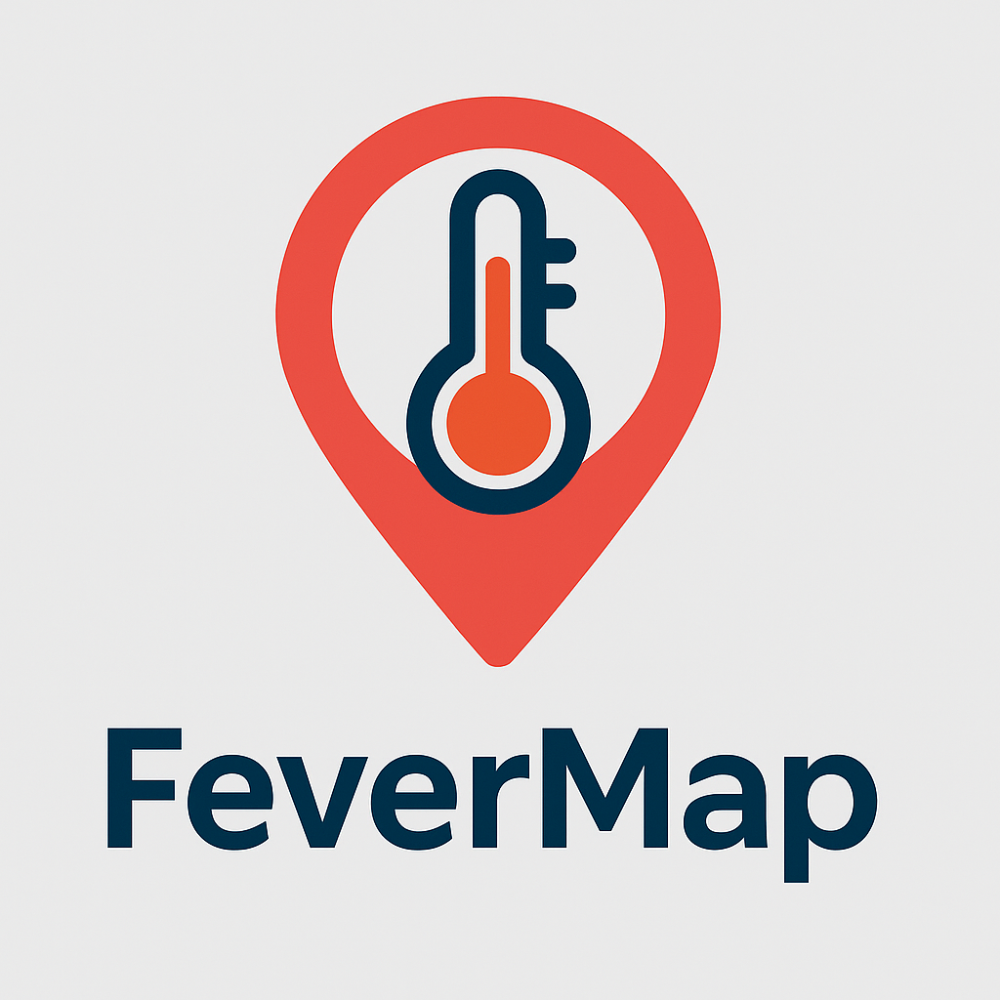

# 🌡️ FeverMap: Data-Driven Dengue Detection System

<p align="center">
  
</p>

<h1 align="center">FeverMap: A Data-Driven Dengue Detection System</h1>

<p align="center">
  
  
  
  
</p>

**FeverMap** is a data analytics project aimed at detecting the potential spread of **Dengue Fever** (DBD) in South Jakarta. The application integrates multiple data sources including weather, health records, IoT mosquito sensors, and crowdsourced symptom reports to provide early warnings of dengue risk.

---

## 📂 Project Structure

```bash
Fever_Map/
├── Datasets/
│   ├── Data_Cuaca_Jakarta_Selatan.xlsx
│   ├── Data_Health_Jakarta_Selatan.xlsx
│   ├── Data_IoT_Sensor_DBD.xlsx
│   └── Data_Crowdsourced_DBD.csv
└── Script Python/
    └── Script DBD App.py
```

## 🧠 Key Features

- 🧪 **Multi-source Data Integration**: Combines weather data, medical reports, mosquito larvae sensors (IoT), and community-submitted data.
- 📅 **Date-Based Synchronization**: Aligns all datasets using consistent time series.
- 🤖 **Risk Detection Logic**: Applies rule-based logic using temperature, humidity, larvae reports, and dengue cases.
- 📤 **Excel Export Output**: Automatically saves results to `Hasil_Deteksi_Potensi_DBD.xlsx`.

## ⚙️ How to Run

### 1. Setup the Environment

Make sure you have `Python 3.x` and install the required libraries:

```bash
pip install pandas openpyxl
```

### 2. Run the Script

Navigate to the `Script Python` folder and run:

```bash
python "Script DBD App.py"
```

### 3. Output

The result file `Hasil_Deteksi_Potensi_DBD.xlsx` will be generated in the same directory.

## 📊 Datasets Used

| Dataset                      | Description                                           |
|-----------------------------|-------------------------------------------------------|
| Data_Cuaca_Jakarta_Selatan  | Daily temperature and humidity data                  |
| Data_Health_Jakarta_Selatan | Recorded dengue cases from medical facilities        |
| Data_IoT_Sensor_DBD         | Mosquito larvae detection from IoT sensors           |
| Data_Crowdsourced_DBD       | Symptom and larvae reports submitted by the public   |

## 🎨 UI/UX Design

Figma Link: [FeverMap Figma Design](https://www.figma.com/design/rKDVImv7z4E4ch8tAHeqqz/Untitled?node-id=0-1&t=lVTlF9tZXdhqyOqQ-1)

## 📸 User Interface Preview

### 🏠 Home & Authentication Pages

| Home Page | Login | Register |
|-----------|-------|----------|
|  |  |  |

### 📝 Questionnaire & Results

| Questionnaire | Result |
|---------------|--------|
|  |  |

### 🗺️ Dengue Risk Maps

| Map 1 | Map 2 |
|-------|-------|
|  |  |

### 🧠 Educational Pages

| Topic 1 | Topic 2 | Topic 3 |
|---------|---------|---------|
|  |  |  |

### 👤 Dashboard & Profile

| Dashboard | Profile |
|-----------|---------|
|  |  |

## 👨‍💻 Developers

- **minzelo** — Raihan Rahman Syah Putra (2702211941)  
- **JohnSmith-Cloud** — Algifary Noer Umaro (2702293506)  
- **Agi-123** — Andragi Bianca (2702385791)  
- **snakebytee** — Darrius Wirya Prajna (2702303791)  
- **eyetolog1st** — Samuel Adrian Murwanto (2702244984)

---

> For questions, feedback, or future development (e.g., real-time detection or map dashboards), feel free to open an issue or submit a pull request.

